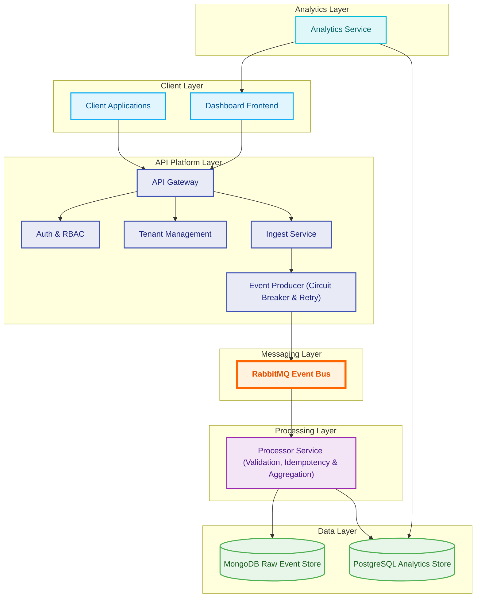

# 🚀 API Monitoring & Analytics Platform


A production-grade, event-driven backend platform designed to collect, process, store, and analyze API traffic at scale.

The platform enables organizations to securely ingest API events, process them asynchronously through RabbitMQ, persist raw event data for auditing, aggregate metrics for analytics, and expose dashboard-ready insights through dedicated analytics APIs.

Built with scalability, reliability, and fault tolerance in mind using modern backend engineering practices such as Event-Driven Architecture, Circuit Breakers, Idempotent Consumers, Retry Strategies, and Multi-Tenant Design.

---

## 🏗️ System Architecture


---

## 🎯 Architecture Highlights

- Event-Driven Architecture using RabbitMQ
- Multi-Tenant Client Management
- JWT Authentication & RBAC
- API Key Authentication
- Circuit Breaker Pattern
- Exponential Retry Strategy
- Idempotent Consumer Processing
- MongoDB Raw Event Store
- PostgreSQL Analytics Store
- Horizontally Scalable Consumer Architecture
- Dockerized Deployment
- Fault-Tolerant Message Processing

---

## ✨ Key Features

### 🔐 Authentication & Authorization

- JWT-based authentication
- Role-Based Access Control (RBAC)
- Super Admin onboarding
- Client Admin management
- Client Viewer management

### 🏢 Multi-Tenant Client Management

- Create and manage multiple clients
- Client isolation
- API Key generation and management
- Role-based access within tenants

### 📥 API Ingestion

- API Key validation
- Rate limiting
- Payload validation
- Event creation and publishing

### 📨 Event-Driven Processing

- RabbitMQ event bus
- Producer confirmation channels
- Exponential retry mechanism
- Circuit breaker protection
- Background consumer processing

### ⚙️ Data Processing

- Schema validation using Zod
- Idempotent event handling
- Raw event persistence
- Metrics aggregation

### 📊 Analytics

- Endpoint-level metrics
- Time-bucket aggregations
- Dashboard APIs
- Fast analytical queries

### 🛡️ Reliability & Scalability

- Circuit Breaker Pattern
- Retry with Exponential Backoff
- RabbitMQ ACK/NACK handling
- Fault-tolerant event publishing
- Containerized deployment

---

# 🎯 Problem Statement

Modern applications generate a massive amount of API traffic that must be monitored, analyzed, and stored efficiently.

Traditional synchronous logging systems often suffer from:

- High request latency
- Tight coupling between services
- Poor fault tolerance
- Limited scalability
- Inefficient analytics querying
- Difficulty handling traffic spikes

This platform addresses these challenges by decoupling ingestion from processing through an event-driven architecture and leveraging specialized databases for operational and analytical workloads.

---

# 🏛️ High-Level Architecture

The platform follows a layered event-driven architecture consisting of six logical layers:

- Client Layer
- API Platform Layer
- Messaging Layer
- Processing Layer
- Data Layer
- Analytics Layer



### Architecture Layers

#### Client Layer

- Dashboard Frontend
- Client Applications

#### API Platform Layer

- API Gateway
- Auth & RBAC
- Tenant Management
- Ingest Service
- Event Producer

#### Messaging Layer

- RabbitMQ Event Bus

#### Processing Layer

- Validation
- Idempotency Checks
- Event Processing
- Metrics Aggregation

#### Data Layer

- MongoDB Raw Event Store
- PostgreSQL Analytics Store

#### Analytics Layer

- Analytics Service
- Dashboard APIs

---

# 🔄 Complete System Workflow

## User Management Flow

```text
Onboard First Super Admin
          ↓
Login
          ↓
Register Additional Super Admins
          ↓
Create Clients
          ↓
Create Client Admins
          ↓
Create Client Viewers
          ↓
Generate API Keys
```

---

## API Ingestion Flow

```text
Client Application
        │
        ▼
POST /ingest
        │
        ▼
API Key Validation
        │
        ▼
Rate Limiting
        │
        ▼
Payload Validation
        │
        ▼
Event Creation
        │
        ▼
Event Producer
        │
        ▼
RabbitMQ
```

---

## Producer Reliability Flow

```text
API Request
    │
    ▼
EventProducer.publishApiHit()
    │
    ▼
CircuitBreaker.allowRequest()
    │
 ┌──┴───────────────┐
 │                  │
Blocked           Allowed
 │                  │
 ▼                  ▼
Fail Fast      Confirm Channel
                    │
                    ▼
                 Publish
                    │
             ACK / NACK
              │       │
              ▼       ▼
          Success   Retry
                        │
                        ▼
                Exponential Backoff
```

---

## Event Processing Flow

```text
RabbitMQ
    │
    ▼
Event Consumer
    │
    ▼
Zod Validation
    │
    ▼
Circuit Breaker Check
    │
    ▼
Idempotency Check
    │
    ▼
Processor Service
    │
 ┌──┴────────────┐
 ▼               ▼
MongoDB      PostgreSQL
```

---

## Analytics Flow

```text
Client Dashboard
       │
       ▼
Analytics Service
       │
       ▼
PostgreSQL Analytics Store
       ▲
       │
Processor Service
       │
       ▼
MongoDB Raw Event Store
```

---

# 🧠 Design Decisions

## Why Event-Driven Architecture?

- Decouples ingestion from processing
- Handles traffic spikes efficiently
- Improves scalability
- Enables asynchronous workflows

---

## Why RabbitMQ?

RabbitMQ acts as the backbone of the platform by:

- Buffering traffic spikes
- Decoupling services
- Supporting acknowledgements
- Enabling retry strategies
- Allowing horizontal consumer scaling

---

## Why MongoDB?

Raw API events require:

- High write throughput
- Flexible schemas
- Efficient storage for large volumes

MongoDB is optimized for this workload.

---

## Why PostgreSQL?

Analytics requires:

- Aggregations
- Grouping
- Reporting
- Time-series metrics

PostgreSQL provides excellent analytical querying capabilities.

---

## Why Circuit Breakers?

Circuit Breakers protect the platform from cascading failures when:

- RabbitMQ becomes unavailable
- Downstream services fail
- Infrastructure experiences instability

---

## Why Idempotent Consumers?

Prevents duplicate event processing caused by:

- RabbitMQ redeliveries
- Consumer restarts
- Network failures
- Unexpected crashes

---

# 🔐 Role Hierarchy

```text
Super Admin
│
├── Create Clients
│
├── Create Client Admins
│
├── Create Client Viewers
│
└── Generate API Keys
```

### Super Admin

Platform-wide administration and client onboarding.

### Client Admin

Manages users, API keys, and analytics within a client organization.

### Client Viewer

Read-only access to analytics and reporting.

---

# 🛠️ Tech Stack

| Category | Technologies |
|-----------|-------------|
| Backend | Node.js, Express.js |
| Messaging | RabbitMQ |
| Databases | MongoDB, PostgreSQL |
| Authentication | JWT, API Keys |
| Validation | Zod |
| Infrastructure | Docker, Docker Compose |
| Logging | Winston |

---

# 📂 Project Structure

```text
src/
│
├── services/
│   ├── auth/
│   ├── client/
│   ├── ingest/
│   ├── analytics/
│   └── processor/
│
├── shared/
│   ├── config/
│   ├── events/
│   ├── middleware/
│   ├── models/
│   └── utils/
│
├── scripts/
│
└── server.js
```

---

# ⚙️ Environment Variables

```env
PORT=

JWT_SECRET=

MONGO_URI=

POSTGRES_HOST=
POSTGRES_PORT=
POSTGRES_DB=
POSTGRES_USER=
POSTGRES_PASSWORD=

RABBITMQ_URL=

SUPER_ADMIN_EMAIL=
SUPER_ADMIN_PASSWORD=
```

---

# 🚀 Getting Started

## Clone Repository

```bash
git clone <repository-url>
cd api-monitoring-platform
```

## Install Dependencies

```bash
npm install
```

## Start Infrastructure

```bash
docker-compose up -d
```

## Initialize PostgreSQL

```bash
npm run init
```

## Start API Server

```bash
npm run dev
```

## Start Consumer Service

```bash
npm run processor
```

---

# 📈 Scalability Considerations

The platform is designed to scale horizontally:

- Multiple API server instances
- Multiple RabbitMQ consumers
- Independent ingestion and processing
- Queue-based workload distribution
- Event buffering during traffic spikes
- Separate analytical datastore

---

# 🛡️ Reliability Features

- Circuit Breaker Pattern
- Confirm Channel Publishing
- Retry Strategy
- ACK/NACK Handling
- Idempotent Consumers
- Event Validation
- Rate Limiting
- API Key Authentication

---

# 🔮 Future Improvements

- Redis caching layer
- Grafana dashboards
- Prometheus metrics
- OpenTelemetry tracing
- WebSocket live analytics
- Kubernetes deployment
- Dead Letter Queue monitoring
- Multi-region deployment
- Alerting & Notification System

---

# 👨‍💻 Author

**Devansh Rai**

Final Year B.Tech (Computer Science)

Institute of Engineering & Technology (IET), Lucknow

Backend Developer | Distributed Systems Enthusiast | Problem Solver

---

## ⭐ If you found this project interesting, consider giving it a star.
